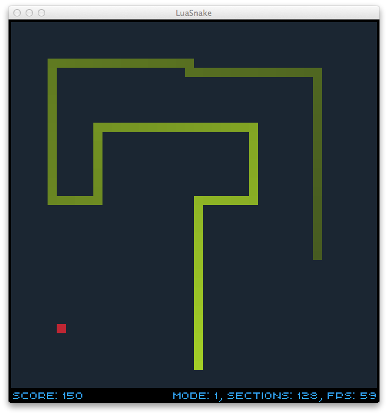

LuaSnake
========
Snake, in Lua, using the Löve engine

=====
If you wish to make some modifications and build the game yourself.
###Windows
There's no way to natively create a zip file from the command line on Windows so I'm afraid you're going to have to do it yourself..

Open the folder "luasnake" and select all the contents, right click > "Send To" > "Compressed (zipped) Folder"

Name this zip file "luasnake.love" and double click it to run the game.

###OS X
Run "./osx.sh" to build the luasnake.love file and then run the game.

###Linux
Run the "./linux.sh" file to build and run the game.

